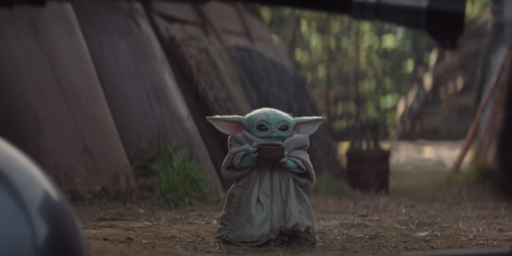
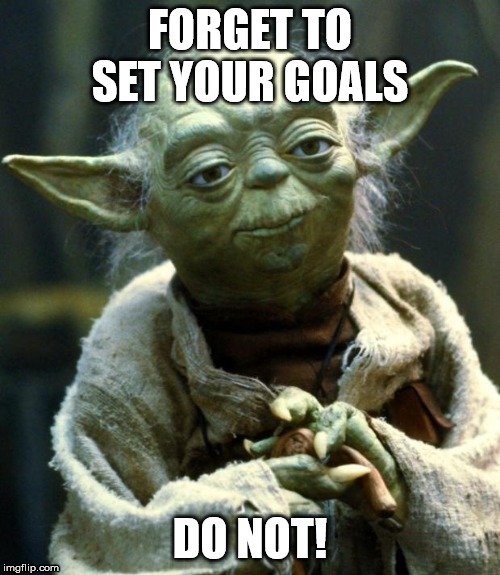

Whether you are on your first voyage or one of many, I learned that having templates, detailed goals, and defined roles for each member are fundamental to having a successful voyage at [Chingu](https://www.chingu.io/).

## Templates are your best friend

Every week we had an hour video conference, and we discovered very soon that sometimes it was hard to understand each other or there was not enough time to cover all the points on the agenda.
For this reason, we incorporated a meeting template with an outline for us to follow in our meetings.
This meeting template got filled by each member before the meeting day. The outline included two main sections that I believe were important to have transparent and to the point meetings.
The first section was three questions addressing what we did the previous week and what we were planning to take on for next week.
The second section was to write down any questions or/and suggestions we would have. My teammate Ming talks more in detail about these sections in our showcase blog post [here](https://medium.com/@mingyong/introducing-moto-from-chingu-voyage-13-c1c1f9e98f80) if you are interested in knowing more about it.

We included templates in other areas to help us be consistent and had a much smoother workflow throughout our voyage.
For instance, we created a template for pull requests on GitHub, and for blog post logs.

Templates will save you time, confusion, and from so much more. I highly recommend implementing templates since day one for your voyages.

## Set Goals - "The Devil is in the Detail"

Detailed goals will help your team to know what to expect of you and other members. In our team, a goal represented a feature for our web application like a TODO, for example. 
Sometimes we wouldn't be able to complete this feature in a week, so we would continue to work on the feature for another week until we got it finished. 
Having these cleared goals established at the beginning of the voyage will enable you to have a clear idea of what it is needed to complete your MVP (most important product) successfully within the six week voyage.

## Assigned Roles
I firmly believe this is the most crucial key element if you want to have a successful voyage. Each member of the team was honest about their strengths, weakness, and areas each felt comfortable to work on the project. 
By setting roles at the beginning of our voyage based on these inputs, we avoid confusion and false expectations that could have emerged. Even if these roles get modified or entirely interchanged with a different member, having these roles will always make things move forward faster on your voyage.

If you are interested in knowing more about the project and team, I worked on Chingu Voyage13, follow the links in our [first Sprint blog post](https://medium.com/@mingyong/chingu-voyage-log-getting-ready-in-sprint-1-ba611ee4d210?sk=b4ae29cc217d78eb303243897e3ade71).

Thank you for reading this far. I genuinely hope it helps you and your team to have an awesome time working together.

Don't know what [Chingu](https://www.chingu.io/) is all about? You are missing out! Read about this excellent program [here](https://www.chingu.io/howitworks).